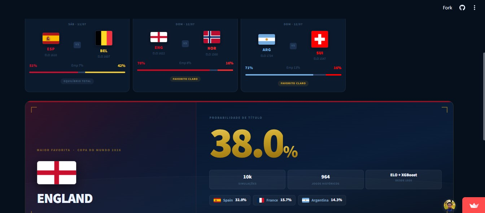

# World Cup 2026 — Probability Simulator

> A data-driven prediction system combining **ELO ratings, XGBoost, and Monte Carlo simulation** to estimate each team's probability of winning the 2026 FIFA World Cup — updated in real time as official results come in.

**[Launch the app →](https://world-cup-2026-predictions-rhf.streamlit.app/)** &nbsp;|&nbsp; `Python` `XGBoost` `Monte Carlo` `Streamlit`


---

## The problem

*"Who's going to win the World Cup?"* sounds simple. Answering it rigorously is not.

Three things make this technically interesting:

**Compounded uncertainty.** A team needs to win **six consecutive matches** against different opponents to become champion. Small quality differences compound in non-linear ways — a model that ignores this systematically underestimates upsets.

**Data scarcity.** The Men's World Cup has only **964 matches** across its entire history through 2022 — fewer than a single Premier League season. Any complex feature engineering will overfit on this volume.

**Non-stationarity.** The 1970 Brazil is not the 2026 Brazil. A model that treats all historical matches as equivalent will overestimate declining powers and underestimate emerging ones.

The project addresses all three with deliberate technical choices, described in the [Methodology](#methodology) section.

---

## Live demo



**[world-cup-2026-predictions-rhf.streamlit.app](https://world-cup-2026-predictions-rhf.streamlit.app/)**

The app has four tabs:

| Tab | Content |
|-----|---------|
| 🥇 Who's going to win? | Tournament progress · upcoming matchups · win probability ranking |
| 🔍 My team | Team profile · ELO rating · stage-by-stage probability funnel |
| 🤔 Why this result? | ELO ranking · ELO history · feature importance · head-to-head simulator |
| 📊 Can I trust this? | Model metrics · methodology · data sources · known limitations |

---

## Architecture

```
app.py                       # Streamlit entry point
│
components/
├── data_loader.py           # Full pipeline: load → ELO → train → simulate
│                            # All results cached with @st.cache_data / @st.cache_resource
├── tab1_overview.py         # Tournament overview tab
├── tab2_team.py             # Team profile tab
├── tab3_why.py              # Explainability tab
├── tab4_trust.py            # Model trust tab
├── teams_2026.py            # Canonical list of 48 qualified teams
├── flags.py                 # Team → flag URL, 3-letter code, nation color
└── theme.py                 # Design tokens and Plotly theme helpers
│
data/
├── fjelstul/matches.csv     # 964 historical matches — Men's WC 1930–2022
└── wc2026_matches.csv       # Official 2026 results (updated as tournament progresses)
                             # Unplayed matches stored with result="scheduled" (skipped in ELO)
```

No database, no serialized model files for production, no external APIs. Everything runs in memory from two CSV files. Adding a new match result to `wc2026_matches.csv` updates the full pipeline on the next app load.

---

## Methodology

### Step 1 — ELO Rating: measuring team strength

ELO ratings are computed sequentially from all **1,061 Men's World Cup matches** (1930–2026), including official 2026 results integrated so far. The rating updates after every match:

```
rating[team_A] += K × (result − expected_result)
```

- `K = 30` — balances historical memory with responsiveness to recent results
- Base rating: **1,500** for teams without World Cup history
- Unplayed 2026 fixtures are flagged as `result="scheduled"` and skipped during ELO computation, preventing data leakage

**Why ELO instead of FIFA rankings?** The FIFA ranking uses proprietary, undocumented weights that have changed across editions. ELO is fully derivable from the same match data the model uses — auditable and dependency-free.

### Step 2 — XGBoost: predicting individual match outcomes

A multi-class XGBoost classifier predicts the result of any match: home win (0), draw (1), or away win (2).

```python
features = ["elo_home", "elo_away", "elo_diff"]  # three variables only
```

The feature constraint is intentional: with ~1,060 training samples, additional features increase variance without reducing bias. Three simple features with regularized XGBoost outperform more complex models in cross-validation.

A Logistic Regression baseline is trained in parallel to quantify the real gain from model complexity:

| Model | Accuracy | vs. random baseline |
|-------|----------|---------------------|
| **XGBoost** | **58%** | **+75%** |
| Logistic Regression | ~55% | +67% |
| Random (3 classes) | 33% | — |

XGBoost outperforms the baseline in both accuracy and log-loss — meaning the probabilities it generates are better calibrated, which directly impacts simulation quality.

**Why not a neural network?** With ~1,060 samples, any high-capacity model overfits. We tested additional features (goal margin, recent form) and neural architectures — marginal gain, higher variance. XGBoost with regularization is the right tool at this data scale.

### Step 3 — Monte Carlo: simulating the full tournament

A team's championship probability is not the probability of winning one match. It is the probability of winning **all required matches**, against opponents who also made it that far.

The tournament is simulated **10,000 times**:

```
For each simulation:
  1. Arrange remaining alive teams in a bracket
  2. For each matchup: XGBoost generates P(home win), P(draw), P(away win)
  3. Weighted random draw determines the winner
  4. Advance to next round until one team remains
  5. Record which team won the title and reached each stage

Result: P(champion) = title count / 10,000
```

With 10,000 samples, the statistical error stays below 1 percentage point per team. The full pipeline — ELO computation, model training, and 10,000 simulations — runs in under 5 seconds.

**Why not compute exact probabilities?** Enumerating all bracket paths grows factorially with the number of teams. Monte Carlo with 10,000 samples converges to <1% error in milliseconds.

---

## Current standings

*Updated after QF France × Morocco · 2026-07-11 · 97 official results integrated*

| ELO Rank | Team | ELO | Status |
|----------|------|-----|--------|
| 1 | Argentina | 1734 | Quarterfinals (pending) |
| 2 | France | 1718 | ✅ Semifinal — 2×0 Morocco |
| 7 | England | 1622 | Quarterfinals (pending) |
| 9 | Spain | 1610 | Quarterfinals (pending) |
| 10 | Belgium | 1607 | Quarterfinals (pending) |
| 14 | Norway | 1560 | Quarterfinals (pending) |
| 16 | Switzerland | 1547 | Quarterfinals (pending) |

*ELO computed across all 1,061 Men's World Cup matches (1930–2026).*

---

## Run locally

```bash
git clone https://github.com/rodrigohigashi/World_Cup_2026_predictions
cd World_Cup_2026_predictions
pip install -r requirements.txt
streamlit run app.py
```

No additional configuration needed. The pipeline automatically detects which teams are still alive from the CSV — adding a new match result to `wc2026_matches.csv` updates the entire model.

**Requirements:** Python 3.10+

---

## Project structure

```
.
├── app.py
├── requirements.txt
├── assets/
│   ├── demo.gif
│   └── home.png
├── components/
│   ├── data_loader.py
│   ├── flags.py
│   ├── tab1_overview.py
│   ├── tab2_team.py
│   ├── tab3_why.py
│   ├── tab4_trust.py
│   ├── teams_2026.py
│   └── theme.py
├── data/
│   ├── fjelstul/            # Historical WC data (1930–2022)
│   └── wc2026_matches.csv   # Live 2026 results
├── notebooks/
│   └── copa2026.ipynb       # Exploratory analysis and model prototyping
└── src/
    ├── build_dataset.py
    ├── download_data.py
    └── model.py
```

---

## Key design decisions

**Temporal ELO, no decay.** We tested a decay factor that reduces the weight of older matches. In retrospective validation (predict Cup N using Cups 1 through N−1), decay degraded calibration. The four-year gap between tournaments already acts as a natural obsolescence filter.

**Random train/test split.** A temporal split (train on 1930–2014, test on 2018 and 2022) would be more rigorous. With ~1,060 samples, the practical impact on the metrics shown is limited — this is documented as a known limitation, not hidden.

**`result="scheduled"` sentinel.** Unplayed fixtures are kept in the CSV with a sentinel value and skipped during ELO computation. This allows `get_current_stage_matches()` to derive upcoming matchups automatically from the same file, without hardcoding bracket structure elsewhere.

**No external model serving.** The model is retrained on every cold start (~1 second). This avoids serialization drift — the model always reflects the latest match data in the CSV.

---

## Known limitations

Documented as part of the methodology, not buried in a disclaimer:

- **WC-only ELO** — Qualifiers, Confederations Cup, and friendlies are excluded. Teams that rarely qualify have limited historical data and less reliable ratings.
- **Penalties as 50/50** — Penalty shootouts are modeled as a coin flip. There is evidence that some nations have a statistical edge (e.g. historically Germany), but the per-team sample size is too small to model reliably.
- **Random bracket** — The real bracket structure is replaced with a random draw in each simulation. This underestimates the impact of favorable or unfavorable crossings.
- **No recent form signal** — ELO captures accumulated historical strength. A team in poor form in the tournament year has no signal captured.

---

## Stack


---

## Recent improvements

- Fixed BYE assignment in Monte Carlo simulations to guarantee statistically uniform brackets.
- Added comprehensive unit tests for bracket generation and simulation logic.
- Corrected tournament stage mapping for different bracket sizes.
- Eliminated home/away bias in knockout matches through symmetric inference while preserving the trained XGBoost model.
- Expanded automated test coverage to prevent regressions.

---

## Possible improvements

- **Temporal train/test split** — Train on Cups 1930–2014, evaluate on 2018 and 2022 only
- **Penalty modeling** — Use per-team historical penalty conversion rates where sample size allows
- **Recent form feature** — Add an exponentially decayed weight to recent matches within the current ELO update
- **Qualification data** — Extend ELO to include World Cup qualifiers for teams with limited Cup history
- **Bracket-aware simulation** — Respect real bracket rules (group winners vs. runners-up) instead of random draw

---

## License

MIT License — see [LICENSE](LICENSE) for details.

---

*Project by [Rodrigo Higashi](https://github.com/rodrigohigashi) · 2026 FIFA World Cup*
